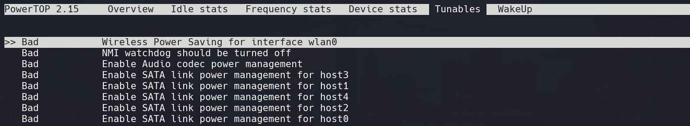

# udev-rules
HP Omen by HP Laptop 15-dc0xxx (2018)

copy udev rules and powertop script:

```sh
sudo cp udev/rules.d/99-powertop.rules /etc/udev/rules.d/
sudo cp pm/power.d/powertop.sh /etc/pm/power.d/

chmod +x /etc/pm/power.d/powertop.sh
```
install powertop:
```sh
sudo pacman -S powertop

or 

sudo apt install powertop
```

run powertop:

```sh
sudo powertop
```

press keytab and go to "Tunables" tab.



**Note:** "Bad" means it's not saving power

Let's test it, plug-out (yes from the AC) the laptop, see how it changes from bad to good Now plug-in back and see how it changes from good to bad.

It's working!, max performance on plug-in and powersave on plug-out.